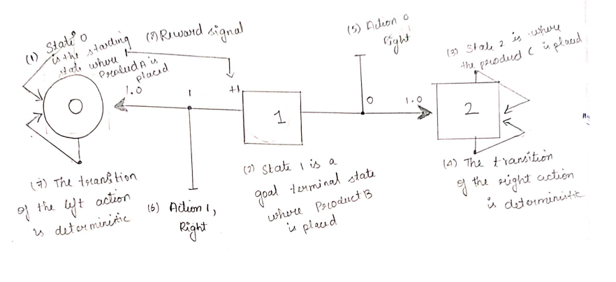
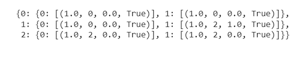

# MDP REPRESENTATION

## AIM:

To represent a Markov Decision Process(MDP) problem in the following ways.

1.Text representation

2.Graphical representation

3.Python - Dictonary representation

## PROBLEM STATEMENT:

### Problem Description

An agent needs to pick product B from a supermarket where there are three products A , B and C

### State Space
{Product A , Product B , Product C}

### Sample State
Product A

### Action Space
[Left , Right , Pick}

### Sample Action
Left

### Reward Function
+1 - when an agent move to the right side and pick product B 

0 - Otherwise

## GRAPHICAL REPRESENTATION


</BR>

## PYTHON REPRESENTATION:

### Developed by: Sneha Basyal M
### Register Number: 212222240101

```
P = {
    0:{
        0: [(1.0,0,0.0,True)],
        1: [(1.0,0,0.0,True)]
    },
    1:{
        0: [(1.0,0,0.0,True)],
        1: [(1.0,2,1.0,True)]
    },
    2:{
        0: [(1.0,2,0.0,True)],
        1: [(1.0,2,0.0,True)]
    }
}
```

## OUTPUT:



## RESULT:

Thus the given Markov Decision Process(MDP) problem is represented in the following ways.

Text representation
Graphical representation
Python - Dictonary representation

